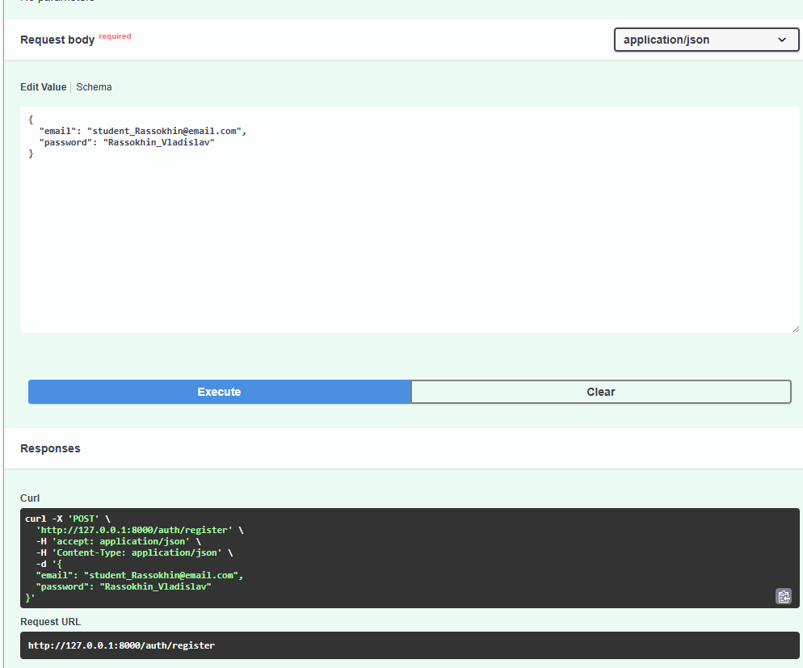
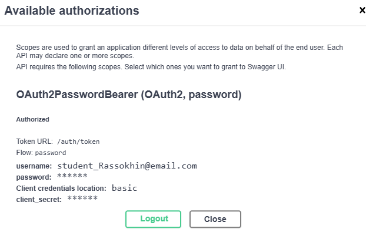
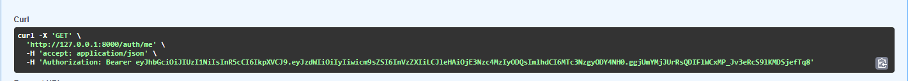
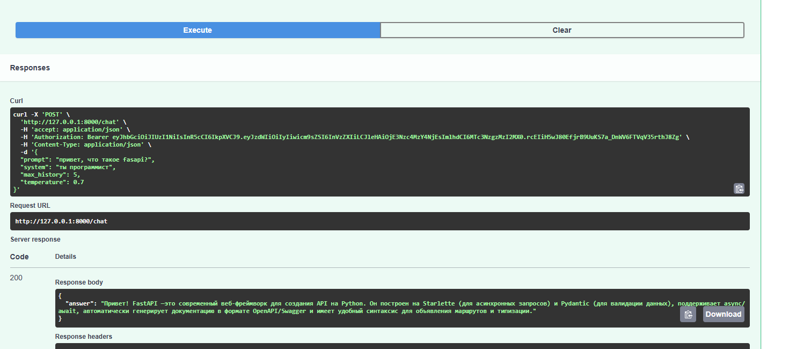
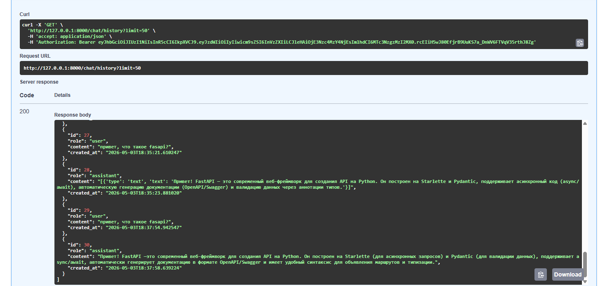
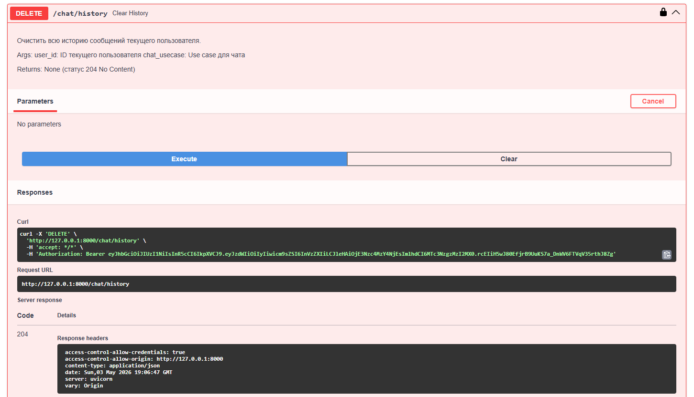
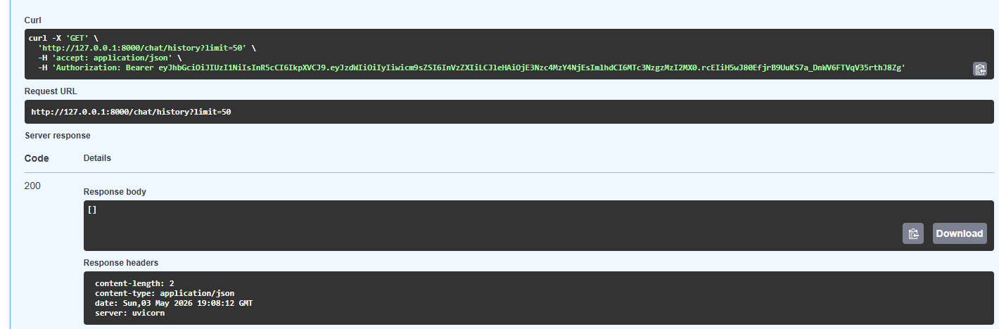

# LLM FastAPI Project

Проект представляет собой backend-приложение на **FastAPI** с регистрацией пользователей, JWT-аутентификацией, защищённым чатом через **OpenRouter**, хранением истории диалога в **SQLite** и разделением приложения на слои `api`, `usecases`, `services`, `repositories`, `schemas`, `db`, `core`.

## Стек проекта

- Python 3.11+
- FastAPI
- Uvicorn
- SQLAlchemy
- SQLite
- Pydantic / Pydantic Settings
- JWT через `python-jose`
- Хеширование паролей через `passlib[bcrypt]`
- HTTP-клиент `httpx`
- OpenRouter API
- uv для управления окружением и зависимостями

## Структура проекта

```text
llm_p/
├── app/
│   ├── api/                 # API-эндпоинты и зависимости FastAPI
│   │   ├── deps.py
│   │   ├── routes_auth.py
│   │   └── routes_chat.py
│   ├── core/                # Конфигурация, безопасность, обработка ошибок
│   │   ├── config.py
│   │   ├── errors.py
│   │   └── security.py
│   ├── db/                  # Подключение к БД, модели SQLAlchemy
│   │   ├── base.py
│   │   ├── models.py
│   │   └── session.py
│   ├── repositories/        # Работа с базой данных
│   │   ├── users.py
│   │   └── chat_messages.py
│   ├── schemas/             # Pydantic-схемы запросов и ответов
│   │   ├── auth.py
│   │   ├── chat.py
│   │   └── user.py
│   ├── services/            # Интеграция с внешними сервисами
│   │   └── openrouter_client.py
│   ├── usecases/            # Бизнес-логика приложения
│   │   ├── auth.py
│   │   └── chat.py
│   └── main.py              # Создание FastAPI-приложения
├── .env.example             # Пример переменных окружения
├── pyproject.toml           # Зависимости проекта
└── README.md
```

## Возможности приложения

- регистрация пользователя по email и паролю;
- сохранение пользователя в SQLite;
- хранение пароля в хешированном виде;
- логин пользователя и выдача JWT access token;
- авторизация через кнопку **Authorize** в Swagger UI;
- защищённый эндпоинт `POST /chat`;
- отправка запроса к LLM через OpenRouter;
- использование модели `stepfun/step-3.5-flash:free`;
- сохранение запросов пользователя и ответов модели в базе данных;
- получение истории текущего пользователя через `GET /chat/history`;
- удаление истории текущего пользователя через `DELETE /chat/history`;
- разделение API-слоя, бизнес-логики, репозиториев и внешнего LLM-сервиса.

## Установка и запуск через uv

Все команды ниже выполняются из корневой папки проекта, в которой находится папка `llm_p`.

### 1. Установить uv

Если `uv` ещё не установлен:

```bash
pip install uv
```

Проверка установки:

```bash
uv --version
```

### 2. Создать виртуальное окружение

```bash
uv venv
```

### 3. Активировать виртуальное окружение

Для Windows PowerShell:

```powershell
.venv\Scripts\Activate.ps1
```

Для Windows CMD:

```cmd
.venv\Scripts\activate.bat
```

Для Linux/macOS:

```bash
source .venv/bin/activate
```


### 4. Скомпилировать зависимости

```bash
uv pip compile llm_p/pyproject.toml -o requirements.txt
```

### 5. Установить зависимости

uv pip install -e .

### 6. Создать файл `.env`

Скопировать пример конфигурации:

Для Windows PowerShell:

```powershell
Copy-Item llm_p\.env.example llm_p\.env
```

Для Linux/macOS:

```bash
cp llm_p/.env.example llm_p/.env
```


### 7. Заполнить `.env`

В файле `llm_p/.env` должны быть указаны настройки приложения, JWT, SQLite и OpenRouter.

Пример:

```env
APP_NAME=llm-p - имя приложения (используется в логах и метаданных)
ENV=local - окружение приложения (local/dev/prod)

JWT_SECRET=change_me_super_secret - секретный ключ для подписи JWT токенов
JWT_ALG=HS256 - алгоритм подписи JWT
ACCESS_TOKEN_EXPIRE_MINUTES=60 - время жизни access token в минутах

SQLITE_PATH=./llm_p/app.db - путь к SQLite базе данных

OPENROUTER_API_KEY=your_openrouter_api_key_here - API-ключ для доступа к OpenRouter
OPENROUTER_BASE_URL=https://openrouter.ai/api/v1 - базовый URL OpenRouter API
OPENROUTER_MODEL=stepfun/step-3.5-flash:free - используемая LLM модель 
OPENROUTER_SITE_URL=http://localhost:8000 - URL приложения (используется OpenRouter)
OPENROUTER_APP_NAME=llm-fastapi-openrouter - имя приложения в OpenRouter

OPENROUTER_TIMEOUT=30 - таймаут запроса к LLM в секундах
OPENROUTER_MAX_RETRIES=3 - количество повторных попыток при ошибках

DEBUG=true - режим отладки (включает подробные ошибки)
LOG_LEVEL=INFO - уровень логирования (DEBUG/INFO/WARNING/ERROR)
```


### 8. Запустить приложение

```

python -m uvicorn llm_p.app.main:app --reload --host 0.0.0.0 --port 8000

### вариант запуска:

```bash
uvicorn llm_p.app.main:app --reload
```

После запуска приложение будет доступно по адресу:

```text
http://127.0.0.1:8000
```

Swagger UI:

```text
http://127.0.0.1:8000/docs
```

Проверка работоспособности:

```text
GET http://127.0.0.1:8000/health
```

Ожидаемый ответ:

```json
{
  "status": "ok",
  "environment": "local",
  "app_name": "llm-p"
}
```


## Работа с API через Swagger

Открыть Swagger UI:

```text
http://127.0.0.1:8000/docs
```


## 1. Регистрация пользователя

Эндпоинт:

```text
POST /auth/register
```

Пример тела запроса:

```json
{
  "email": "student_surname@email.com",
  "password": "Password123"
}
```



## 2. Логин и получение JWT

Эндпоинт:

```text
POST /auth/token
```

В Swagger используется форма OAuth2. Нужно заполнить:

```text
username: student_surname@email.com
password: Password123
```

Пример успешного ответа:

```json
{
  "access_token": "jwt_access_token",
  "token_type": "bearer"
}
```



## 3. Авторизация через Swagger

В Swagger токен заполняется автоматически после введения логина и пароля **Authorize** вводить отдельно токен не нужно:

```text
username: student_surname@email.com
password: Password123
```



## 4. Отправка сообщения в LLM

Эндпоинт:

```text
POST /chat
```

Эндпоинт защищён JWT-токеном. Без авторизации он должен возвращать ошибку `401 Unauthorized`.

Пример тела запроса:

```json
{
  "prompt": "Привет! Объясни, что такое FastAPI простыми словами.",
  "system": "Отвечай кратко и понятно.",
  "max_history": 5,
  "temperature": 0.7
}
```



## 5. Получение истории диалога

Эндпоинт:

```text
GET /chat/history
```

Эндпоинт возвращает историю сообщений только текущего авторизованного пользователя.

Пример успешного ответа:
```json
[
  {
    "id": 1,
    "role": "user",
    "content": "Привет! Объясни, что такое FastAPI простыми словами.",
    "created_at": "2026-05-03T15:00:00"
  },
  {
    "id": 2,
    "role": "assistant",
    "content": "FastAPI — это фреймворк Python для создания быстрых веб-API.",
    "created_at": "2026-05-03T15:00:05"
  }
]
```



## 6. Удаление истории диалога

Эндпоинт:

```text
DELETE /chat/history
```

После успешного удаления сервер возвращает статус:

```text
204 No Content
```

Проверить удаление можно повторным запросом:

```text
GET /chat/history
```

Ожидаемый ответ:

```json
[]
```



